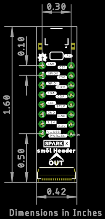

# SparkX smôl Header

[*SparkX smôl Header (SPX-18620)*](https://www.sparkfun.com/products/18620)

A header to break out the smôl FPC connections.

## Repository Contents

- **/Hardware** - Eagle design files
- **LICENSE.md** contains the licence information

## Product Versions

- [SPX-18620](https://www.sparkfun.com/products/18620) - Original SparkX Release.

## License Information

This product is _**open source**_!

Please review the LICENSE.md file for license information.

If you have any questions or concerns on licensing, please contact technical support on our [SparkFun forums](https://forum.sparkfun.com/viewforum.php?f=123).

Distributed as-is; no warranty is given.

- Your friends at SparkFun.
